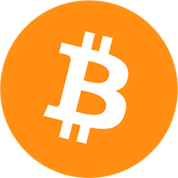
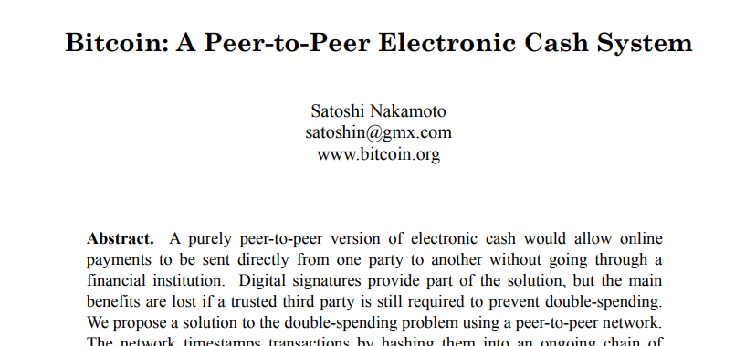

class: middle, center, title-slide

# Large-scale Distributed Systems

Lecture 10: Blockchain

???

- Insist on Nakamoto-consensus

---

# Today

---

# Money vs the Internet

- Many everyday things have *moved* to the Internet.
- Communications, relations, entertainment, ... but **not money**.

 
.center.width-50[]
.caption[Why do we still need these?]

---

# What about credit cards?

- Credit cards are **inherently insecure**.
- Entire model is *backwards*:
    - Merchant takes the customer's CC number.
    - Merchant goes to the bank.
    - Merchant gives CC number to the customer's bank.
    - Bank gives money from the customer's account to the merchant.
- Something like this would be better:
    - Customer tells bank to give money to merchant.
    - That's it!

---

# Making money digital

- Why not create a **currency** based on cryptography?
- Our design goals should be a currency with the following *properties*:
    - Secure transfer in computer networks
    - Cannot be copied and reused
    - Anonymity
    - Offline transactions
    - Can be transferred to others
    - Can be subdivided

---

# The failure of electronic cash

- There have been several proposals for digital money.
- Until a few years ago, all had failed.
- No gain over existing systems:
    - Still need a central point of trust
    - Privacy: who monitors the system?
    - Can we entrust a bank with managing an entire currency?

---

# Bitcoin

.center.width-20[]

.grid[
.col-3-4[
- The bitcoin protocol was proposed in 2008.
- Takes care of:
    - Creation of new currency
    - Secure transactions
    - Protection against double-spending
    - Anybody can be a merchant or a customer
    - Pseudo-anonymity
]
.col-1-4[.center[]]
]

.center.width-70[]

---

# Bitcoin, from scratch

---

# Southfork v1

---

# Southfork v2

---

# No central point of trust

---

# Southfork v3: the blockchain

---

# Double-spending is still possible

---

# Asking the network about the transaction

---

# Southfork v4: Proof of work

---

# PoW challenge

---

# Miners

---

# Example

---

# Mining as a competition

---

# Blocks

---

# Transactions

---

# Each block gives security to the previous ones

---

# This is how Bitcoin works!

---

# Applications

---

# Summary

---

# References

- Jonathan Jogenfors, Cryptography Lecture 12: [Bitcoin and friends](https://www.icg.isy.liu.se/courses/tsit03/forelasningar/cryptolecture12.pdf).
