class: middle, center, title-slide

# Large-scale Distributed Systems

Lecture 10: Blockchain

???

R: work on the flow!
R: what is money?
R: explain transactions more precisely
R: insist on consensus
R: the flow with the Generals is not good)
R: what kind of fraud does the system prevent? (forgery by signature, double-spending by pow)
R: illustrate double spending examples with concurrent branches
R: do merchants have to wait for 1 hour?
R: add https://anders.com/blockchain/blockchain.html

---

# Today

.center.width-80[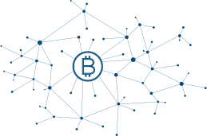]

Most of today's lecture slides are taken from Jonathan Jogenfors, "Cryptography Lecture 12: [Bitcoin and friends](https://www.icg.isy.liu.se/courses/tsit03/forelasningar/cryptolecture12.pdf)".

---

# Money vs the Internet

- Many everyday things have *moved* to the Internet.
- Communications, relations, entertainment, ... but **not money**.

 
.center.width-50[]
.caption[Why do we still need these?]

---

# What about credit cards?

- Credit cards are **inherently insecure**.
- Entire model is *backwards*:
    - Merchant takes the customer's CC number.
    - Merchant goes to the bank.
    - Merchant gives CC number to the customer's bank.
    - Bank gives money from the customer's account to the merchant.
- Something like this would be better:
    - Customer tells bank to give money to merchant.
    - That's it!

---

# Making money digital

- Why not create a **currency** based on *cryptography*?
- Our design goals should be a currency with the following properties:
    - Secure transfer in computer networks
    - Cannot be copied and reused
    - Anonymity
    - Offline transactions
    - Can be transferred to others
    - Can be subdivided

---

# The failure of electronic cash

- There have been several proposals for digital money.
- Until a few years ago, all had failed.
- No gain over existing systems:
    - Still need a central point of trust
    - Privacy: who monitors the system?
    - Can we entrust a bank with managing an entire currency?

---

# Bitcoin

.center.width-20[]

.grid[
.col-3-4[
- The bitcoin protocol was proposed in 2008.
- Takes care of:
    - Creation of new currency
    - Secure transactions
    - Protection against double-spending
    - Anybody can be a merchant or a customer
    - Pseudo-anonymity
]
.col-1-4[.center[]]
]

.center.width-70[]

---

class: middle, center

# Bitcoin from scratch

Step by step, we will build a peer-to-peer currency,  
discussing strengths and weaknesses.

---

# v1: Public, signed transactions

.center.width-70[]
.center["I, Alice, send one coin to Bob."]
 

- Alice publishes a **signed** message.
- Benefits:
    - Bob can *verify* the signature as being from Alice.
    - The transaction cannot be undone.
- Downsides:
    - No account balances.
    - Infinite number of coins. Very incomplete protocol.

---

# v2: Serial numbers

.center.width-70[]
.center["I, Alice, send coin no. 856034 to Bob."]
 

- Duplicate transactions are easily spotted.
- How are the serial numbers created?
- Easy solution: Serial numbers are generated by a *trusted* source, like a bank.

---

# No middleman?

- A bank works, but can we *remove the central point of trust*?
- We want a decentralized, **self-governing** network.
- Instead, we establish a list of all transactions ever made.
- Computing an account balance is done by summing over all previous transactions for that account.
- This list is called the **blockchain** and is *shared by all users*.

---

# v3: The blockchain

.center.width-70[]
.center["Bob checks his blockchain before accepting the transaction."]
 

- If he sees that the coin is owned by Alice, he accepts it.
- After the transaction is complete, Bob broadcasts his acceptance.
    - Bitcoin relies on a **gossiping** protocol for the broadcast.
- As soon as the other peers hear this broadcast, they will not allow *double-spending*.

---

# Double-spending

.center.width-70[]

- **Double-spending** is still possible.
- Alice can perform a double-spend before the acceptance broadcast is hear by enough peers.
- To solve this problem, we make Bob ask everybody else to *confirm the transaction validity*.
- Double-spending will be noticed before payment is confirmed.

---

# Verifying transactions

- How many answers should Bob require? How can answers be trusted?
- A *majority vote* is **impossible**.
    - What if Alice controls other peers and spams Bob with false confirmations?
- But Bitcoin will not work if transactions cannot be reliably verified...

.center.width-60[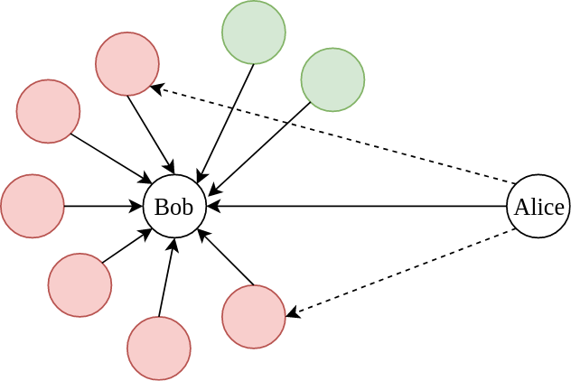]
.caption[A sybil attack from Alice]

???

DHTs are also vulnerable to sybil attacks.

---

class: middle, center

We need *consensus*, in the presence of **malicious** peers!

---

# The Byzantine Generals Problem

.center.width-100[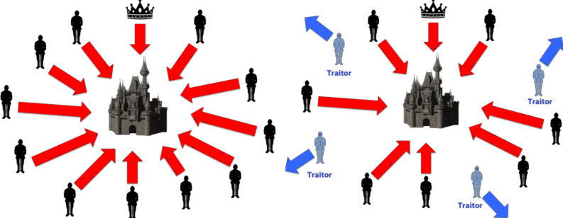]

---

# The Byzantine Generals Problem

- Each division of the Byzantine army is directed  by its own general.
- Generals, some of which are **traitors**, communicate with each other by messengers.
- Requirements:
    - All *loyal* generals must decide upon the same plan of action (attack or retreat).
    - A small number of traitors cannot cause the loyal generals to adopt a bad plan.
- **Impossibility result**:
    - No solution exists if $\leq 2/3$ generals are loyal.    

---

# v4 (final): Proof of work

- To verify transactions, the Bitcoin protocol uses *Proof of Work* (PoW).
- Basic idea: We only trust solutions that are accompanied by a proof of someone having committed a large amount of resources to a problem.
- That is, we do not authenticate a *user*, but we authenticate the fact time/money/energy/etc has been spent.
- In order for Alice to make a double-spend, she **first has to spend energy** before Bob trusts here.
- Even better: we turn proof-of-work into a competition.

---

# The PoW challenge

- We want a problem that...
    - is **difficult to solve**
    - has solutions that are *easy to verify*
    - has *scalable difficulty*
- Finding (partial) hash collision  as proof-of-work:
    - A one-way hash function $h(x)$ has the following properties:
        - Easy to compute $h(x)$ from $x$.
        - Given $h(x)$, it is difficult to find $x'$ such that $h(x') = h(x)$.
    - Finding pre-images is the perfect proof-of-work!
    - Bitcoin uses $h(x)=\text{SHA256}(\text{SHA256}(x))$

---

# Mining

- Blocks of transactions are verified by special peers called **miners**.
- Assume that Alice's transaction message $m$ is broadcast:
    - "I, Alice, send coin no. 856034 to Bob."
- Mining algorithm:
    - A miner selects a random *nonce* $k$ and computes $h(m+k)$.
    - If $h(m+k)>T$, the miner chooses a new $k$ and tries again.
    - After a long time, a miner eventually finds $k$ such that $h(m+k)<T$ and broadcasts $k$.
    - Bob receives $k$ and checks that $h(m+k)<T$ to accept the transaction.

---

# Example

- Let the threshold $T$ be so that the hash value $h(m+k)$ needs five leading zeros and let $m$="AAA".

.center.width-50[]

- Note that in the normal case, $k$ is chosen randomly.
- There are several solutions $k$ to the problem $h(m+k)<T$.

---

# Mining is a competition (1)

.center.width-80[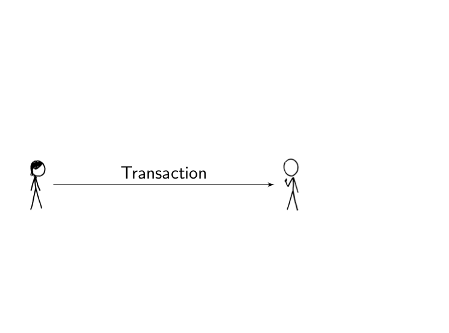]

---

# Mining is a competition (2)

.center.width-80[]

---

# Mining is a competition (3)

.center.width-80[]

---

# Mining is a competition (4)

.center.width-80[]

---

# Mining is a competition (5)

.center.width-80[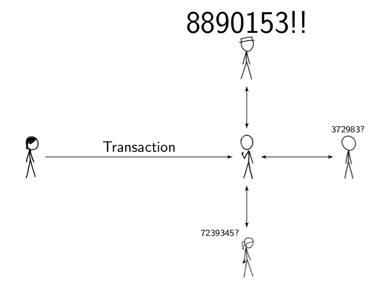]

---

# Mining is a competition (6)

.center.width-80[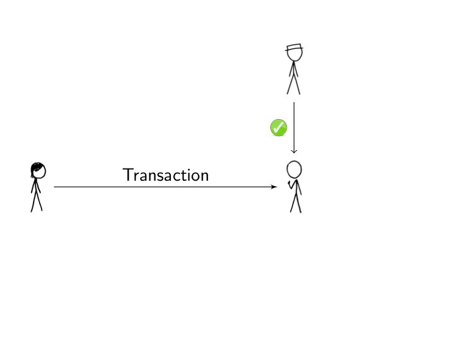]

---

# Blocks

.center.width-80[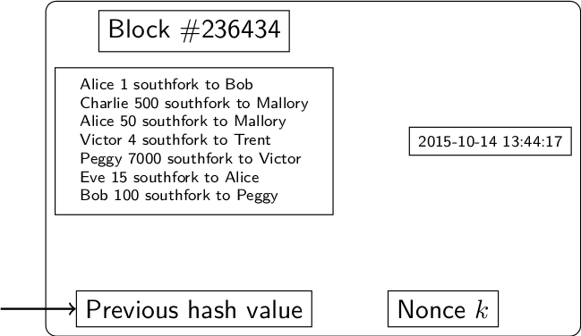]

- A **block** is a large number of transactions.
- A block is only *valid* if its hash value is less than $T$.

---

# The blockchain

- The process of adding transactions into the distributed ledger is called *mining*.
- Transactions are grouped in blocks, that are numbered and form a long chain, called the **blockchain**.

.center.width-60[]

- If two miners find a valid block simultaneously, the resolution strategy is to switch to the branch with the largest cumulated work.

.center.width-60[]

---

# Security

.center.width-60[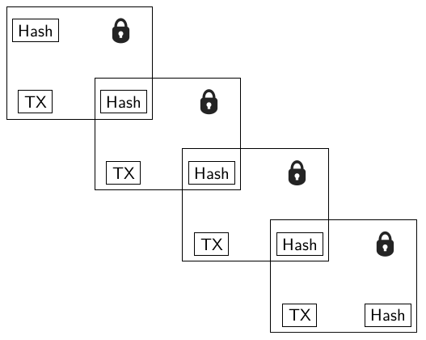]

- Each block gives **security** to the previous ones in the branch.
    - The hash of a block is computed partly based on the hash of the previous hash.
- Bob *waits for 6 blocks before accepting Alice's transaction*.
- Forging transactions requires finding collisions for all blocks in the suffix, which requires a large amount of work.

---

# Consensus by proof-of-work

- Consensus is guaranteed *probabilistically*, provided that the majority of the hashing power is detained by loyal nodes.
- The only way for Alice to cheat the system would be to:
    - Buy a supercomputer;
    - Save up money for the electricity bill;
    - Broadcast an invalid transaction $m$ to Bob;
    - Let the supercomputer search for a block containing $m$.
    - The computer must be faster than everybody else's, **combined**.
- Alice has a hard time cheating Bob:
    - With 1% of the total hashing power, the chance of mining six blocks in a row is $0.01^6 = 10^{-12}$.
- Therefore, with high probability, transactions confirmed in the ledger are legit.

---

# New coins

- The number of transactions in a block is *automatically adjusted* to aim for an average block rate of 1 block / 10 minutes.
- When a new block is discovered, the miner may **award itself a certain number of coins**.
    - Currently:
        - The bounty is 12.5BTC.
        - $T$ is set to hash values beginning with $\geq$ 20  zeros.
            - `000000000000000000af0d5752187e109c477ea70bb96c5c5aa8f92c6a6c8b02`
- In addition, the miner also keep the transaction fees bitcoin holders pay when using the currency.
- The block reward decreases every 210 000 blocks.
- The total number of coins is limited to 21 000 000.
- The last Bitcoin should be mined in 2140.

[Q] How long does it take confirm a transaction? (on average)

---

class: center, middle

.width-100[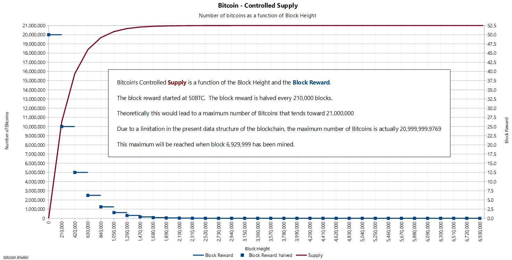]

---

# Bitcoin trading

- Bitcoin can be bought and sold like any other currency.
- Bitcoin ATMs even exist in some countries!

.center.width-50[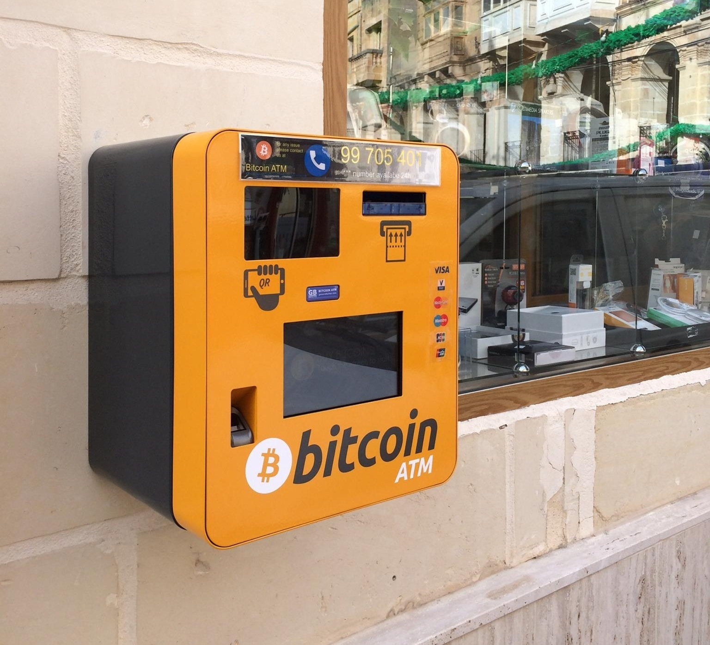]

---

# Transactions

.center.width-70[]

- The blockchain does not store currencies.
- It only stores transactions from one address to the other.
- The balance of an address is computed by summing over all transactions associated to the address.

???

http://chimera.labs.oreilly.com/books/1234000001802/ch02.html#_creating_the_outputs

---

class: middle, center

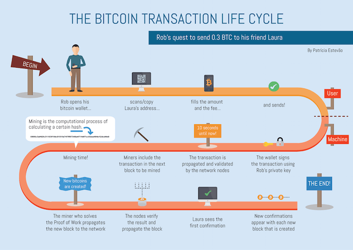

---

# Volatility

.center.width-100[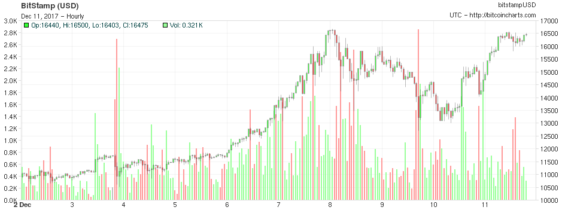]

- Today: 1 BTC $\approx$ 16500 USD (Dec 11, 2017)
- Bitcoins remain highly **volatile**.
- A volatile asset is risky to hold:
    - On any given day, its value may go up or down substantially.

---

# Bitcoin mining is a big business

.center.width-100[]
.caption[A bitcoin mining farm.]

---

# Extreme competition

.center.width-100[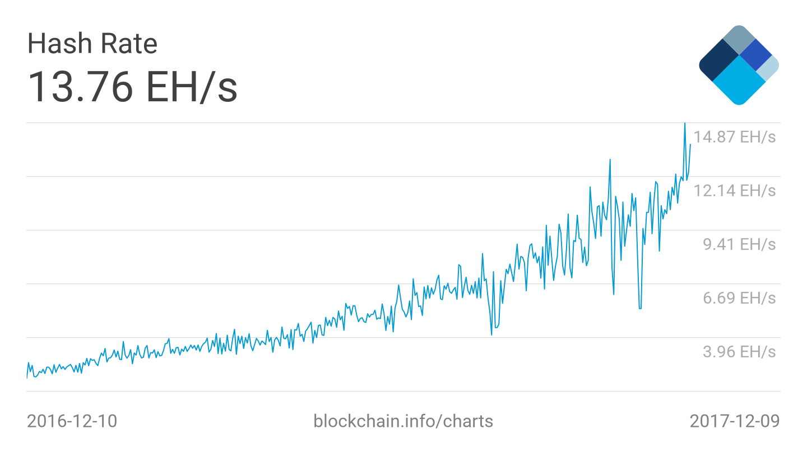]

???

EH/s = 10^18 hashes/s

---

# Energy sinkhole

.center.width-80[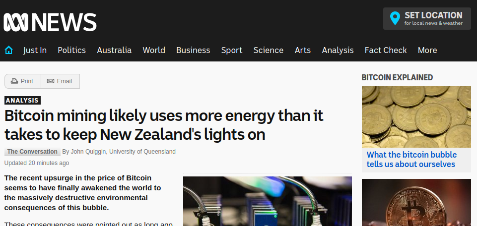]
.center.width-80[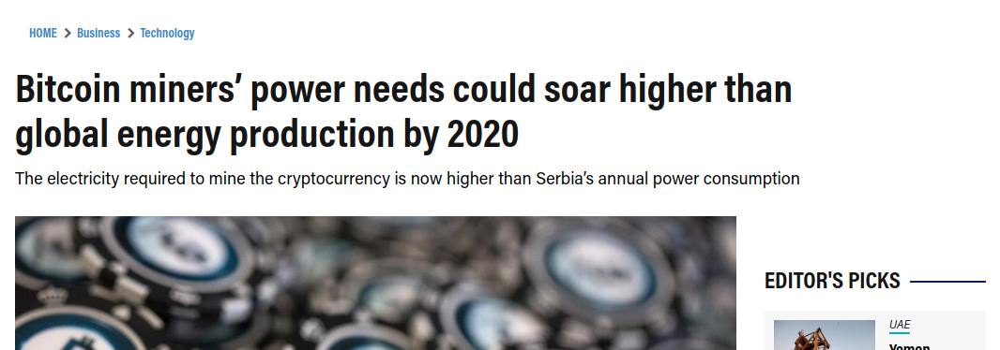]

---

# Bitcoin and trust

- In Bitcoin, users only need to **trust** the algorithm, nothing else.
- In contrast, with traditional currency trust is in a central bank.
- You don't even need to trust the initial creator.

---

class: center, middle

<iframe width="640" height="480" src="https://www.youtube.com/embed/SJgWqbZBn6I?&loop=1&start=0" frameborder="0" volume="0" allowfullscreen></iframe>

---

# Other applications

- A blockchain can be viewed as a continuously growing list of records.
- Blockchains are secure by design, with *high Byzantine fault tolerance*.
- In addition to storing transactions, blockchains can therefore be used to store sensitive information that should not be altered.

.center.width-80[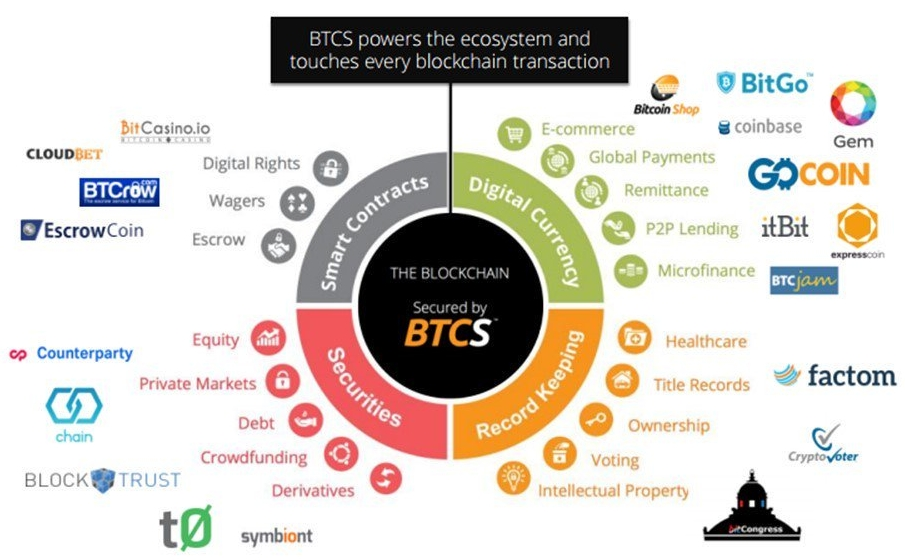]

---

# Summary and challenges

- Bitcoin is a peer-to-peer *fully decentralized currency* based on the blockchain.
- The core principles of the *blockchain* rely on **consensus** by proof-of-work.
- As a currency:
    - Bitcoin is very young,
    - Transactions are safe, storage is not.
    - If Alice loses her key, she loses her money.
    - If Eve finds Alice's key, she can get her money.
    - Taxation? Volatility? Illicit trade?

---

# References

- Nakamoto, Satoshi. "Bitcoin: A peer-to-peer electronic cash system." (2008): 28.
- Jonathan Jogenfors, "Cryptography Lecture 12: [Bitcoin and friends](https://www.icg.isy.liu.se/courses/tsit03/forelasningar/cryptolecture12.pdf)".
